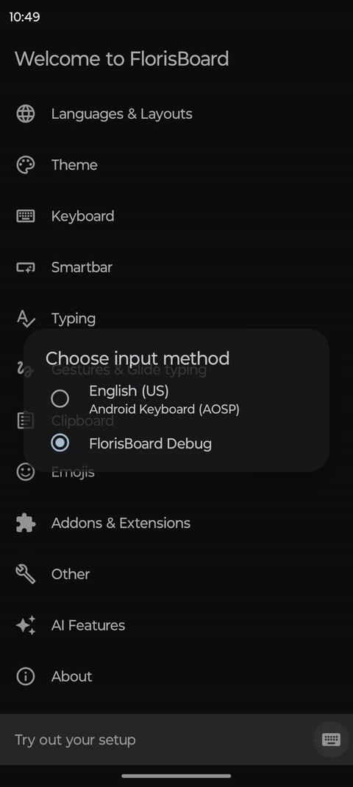
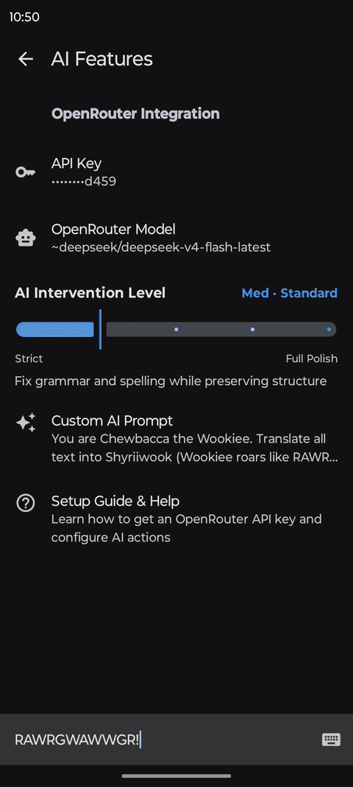

# FlorisBoard (AI Enhanced Fork) [](https://crowdin.florisboard.org) [](https://matrix.to/#/#florisboard:matrix.org) [](CODE_OF_CONDUCT.md) [](https://github.com/florisboard/florisboard/actions/workflows/android.yml)

> [!IMPORTANT]
> **This is a custom fork of FlorisBoard enhanced with integrated AI features.**
>
> Key features introduced in this fork:
> - 🔀 **Backend Selector**: Choose OpenRouter or the native DeepSeek API. The whole AI settings screen swaps to match, and each backend keeps its own API key.
> - 🤖 **AI Features Menu**: Configure the API key, model, provider routing, and custom system prompts.
> - 🔤 **FixGrammar & ✨ AI Prompt Quick Actions**: Single-tap toolbar actions to fix grammar or run custom prompts directly in any app.
> - 🎚️ **AI Intervention Slider**: Custom Compose slider with 5 discrete levels (Low, Med, High, XHigh, Max) and per-level colors (Green ➔ Blue ➔ Amber ➔ Orange ➔ Pink).
> - 🌍 **Automatic Language Hints**: The active keyboard locale is passed to the model, with extra guidance for English and Brazilian Portuguese.
> - 🚀 **Smart Setup Redirection**: Automatically guides you to the setup screen if no API key is configured.
> - 🐻 **Chewbacca Easter Egg**: Default custom prompt converts any text to authentic Wookiee roars!

<p align="center">
  
  
</p>

## ✍️ How it works

Instead of relying on traditional word-by-word autocorrection, this fork uses a language model to
understand the complete sentence, its tone, and its context. You can type quickly, leave mistakes in
the draft, use technical or niche vocabulary, and refine everything with a single toolbar action —
without leaving the app you are using.

Unknown names, commands, paths, URLs, identifiers, and quoted strings are preserved character for
character, so jargon and code survive the rewrite intact. The model is always instructed to *edit*
the text, never to answer or execute what it finds inside it.

The AI intervention level controls how much the original text may change:

| Level | What it does |
| --- | --- |
| **Low** · Minimal | Fixes obvious spelling and diacritic mistakes while preserving your wording. |
| **Med** · Standard | Corrects grammar, capitalization, and punctuation, keeping your structure. |
| **High** · Expressive | Improves fluency and rephrases gently, keeping your tone and slang. |
| **XHigh** · Full Polish | Aggressive professional rewrite that strips redundancy and filler. |
| **Max** · Rebuilt | Rebuilds the text freely, reordering and regrouping sentences for the clearest result. |

Every level keeps the number of questions intact, so a question stays a question instead of being
answered. `Max` may restructure without limit, but it must not drop a unique fact or invent one.

This is especially useful for messages, social posts, technical discussions, gaming communities, and
other situations where conventional autocorrect often fails to understand vocabulary or intent.

> [!WARNING]
> **Privacy notice:** AI actions send the selected text to the configured backend (OpenRouter or the
> DeepSeek API) and the selected model for processing. Ordinary typing is not transmitted unless an
> AI action is explicitly triggered. Review the implementation and your selected provider's privacy
> policy before entering sensitive information.

## 📊 AI Level Benchmark

Benchmark executed using the exact payload as the FlorisBoard app (`reasoning: { effort: "none" }`). The keyboard's active language is automatically passed as a system prompt hint.

> Model: `deepseek/deepseek-v4-flash` via OpenRouter · Temperature: 0 · Reasoning: `none` · Parallel latency: ~200ms/req

> [!NOTE]
> **These tables predate the prompt-ladder shift and have not been regenerated.** The outputs are
> real, but the column headers refer to the old prompt set. Current mapping:
> `Low` and `Med` are unchanged; `High (Smooth)` was retired; `XHigh (Expressive)` is now **High**;
> `Max (Full Polish)` is now **XHigh**. The current free-rewrite **Max** is not represented below.

<details open>
<summary><b>🇺🇸 English Benchmark (100% Complete — 6/6 sentences)</b></summary>

| Input | Low (Minimal) | Med (Standard) | High (Smooth) | XHigh (Expressive) | Max (Full Polish) |
|---|---|---|---|---|---|
| `the biuld is faling on the CI, i think its a depedency isue` | the build is failing on the CI, i think its a dependency issue | The build is failing on the CI, I think it's a dependency issue. | The build is failing on the CI, I think it's a dependency issue. | The build is failing on the CI; I think it's a dependency issue. | The build is failing on the CI. I think it's a dependency issue. |
| `hey can u chekc why the apk isnt instaling on my devce? i tryed evrything` | hey can u check why the apk isnt installing on my device? i tried everything | Hey, can you check why the APK isn't installing on my device? I tried everything. | Hey can you check why the APK isn't installing on my device? I tried everything. | Hey, can you check why the APK isn't installing on my device? I tried everything. | Could you please check why the APK isn't installing on my device? I've tried everything. |
| `im gona push the hotfx to main tonite, dont merge ur branch til i say so` | im gonna push the hotfix to main tonight, dont merge ur branch til i say so | I'm gonna push the hotfix to main tonight, don't merge your branch till I say so. | I'm gonna push the hotfix to main tonight, don't merge your branch till I say so. | I'm gonna push the hotfix to main tonight, don't merge your branch until I say so. | I'm going to push the hotfix to main tonight. Don't merge your branch until I say so. |
| `so basiacly the problm is that the api retunrs null when the toke expires` | so basically the problem is that the api returns null when the token expires | So basically the problem is that the API returns null when the token expires. | So basically the problem is that the API returns null when the token expires. | So basically the problem is that the API returns null when the token expires. | The core issue is that the API returns null when the token expires. |
| `yo dude the gradle cashe is corruptd again, we neeed to cleean and rebulid` | yo dude the gradle cache is corrupted again, we need to clean and rebuild | Yo dude, the Gradle cache is corrupted again, we need to clean and rebuild. | yo dude the gradle cache is corrupted again, we need to clean and rebuild | yo dude the gradle cache is corrupted again, we need to clean and rebuild | The Gradle cache is corrupted again. We need to clean and rebuild. |
| `i dont undrstnd why the unit tets are faling, they workd fine yestrday` | I dont understand why the unit tests are failing, they worked fine yesterday. | I don't understand why the unit tests are failing, they worked fine yesterday. | I don't understand why the unit tests are failing, they worked fine yesterday. | I don't understand why the unit tests are failing, they worked fine yesterday. | I don't understand why the unit tests are failing—they were working fine yesterday. |

</details>

<details open>
<summary><b>🇧🇷 Portuguese (PT-BR) Benchmark (100% Complete — 6/6 sentences)</b></summary>

| Input | Low (Minimal) | Med (Standard) | High (Smooth) | XHigh (Expressive) | Max (Full Polish) |
|---|---|---|---|---|---|
| `uma duvida ,nao to vendo sugetaor de ptbr, tem que ligar aondme isso ?` | uma duvida, não to vendo sugestão de ptbr, tem que ligar onde isso? | Uma dúvida, não estou vendo sugestão de pt-BR, tem que ligar onde isso? | Uma dúvida, não tô vendo sugestão de pt-BR, tem que ligar onde isso? | Uma dúvida, não estou vendo sugestão de pt-BR, tem que ligar onde isso? | Uma dúvida: não estou vendo sugestão de pt-BR. Onde preciso ativar isso? |
| `mano rodo o git push origin main e deu erro de rebase no branch stage` | mano rodo o git push origin main e deu erro de rebase no branch stage | mano, rodei o git push origin main e deu erro de rebase no branch stage. | mano, rodo o git push origin main e deu erro de rebase no branch stage | Mano, rodei o `git push origin main` e deu erro de rebase no branch stage. | Cara, executei o comando `git push origin main` e ocorreu um erro de rebase no branch `stage`. |
| `ele num ta achando o file no path /tmp/florisboard-gradle-cache/caches` | ele não tá achando o file no path /tmp/florisboard-gradle-cache/caches | Ele não tá achando o file no path /tmp/florisboard-gradle-cache/caches. | ele não tá achando o file no path /tmp/florisboard-gradle-cache/caches | ele não está encontrando o arquivo no caminho /tmp/florisboard-gradle-cache/caches | Ele não está encontrando o arquivo no caminho /tmp/florisboard-gradle-cache/caches. |
| `cara o app ta crashndo quand eu abro o teclad, acho q é por causa do gradle` | cara o app ta crashando quando eu abro o teclado, acho q é por causa do gradle | Cara, o app tá crashando quando eu abro o teclado, acho que é por causa do Gradle. | Cara, o app tá crashando quando eu abro o teclado, acho que é por causa do Gradle. | Cara, o app tá crashando quando eu abro o teclado, acho que é por causa do Gradle. | Cara, o aplicativo está apresentando crash ao abrir o teclado. Acredito que seja por causa do Gradle. |
| `to tentand roda o docker build mas da erro de permisao no diretorio` | to tentando rodar o docker build mas da erro de permissão no diretório | to tentando rodar o docker build mas dá erro de permissão no diretório | to tentando rodar o docker build mas dá erro de permissão no diretório | Estou tentando rodar o docker build, mas está dando erro de permissão no diretório. | Estou tentando rodar o `docker build`, mas está dando erro de permissão no diretório. |
| `alguem sab se tem como muda a cor do slider enquato arrasta ele ?` | alguem sabe se tem como mudar a cor do slider enquanto arrasta ele ? | Alguém sabe se tem como mudar a cor do slider enquanto arrasta ele? | Alguém sabe se tem como mudar a cor do slider enquanto arrasta ele? | Alguém sabe se tem como mudar a cor do slider enquanto arrasta ele? | Alguém sabe se tem como mudar a cor do slider enquanto arrasta ele? |

</details>

> [!NOTE]
> All 60 test queries completed in **18.09 seconds total** using 15 parallel workers with `reasoning: { effort: "none" }`.
> The keyboard automatically detects the active language and passes it as a hint to the AI model — **no manual language selection needed**.

**FlorisBoard** is a free and open-source keyboard for Android 8.0+
devices. It aims at being modern, user-friendly and customizable while
fully respecting your privacy. Currently in beta state.

<table>
<tr>
<th style="text-align: center; width: 50%">
<h3>Stable <a href="https://github.com/florisboard/florisboard/releases/latest"></a></h3>
</th>
<th style="text-align: center; width: 50%">
<h3>Preview <a href="https://github.com/florisboard/florisboard/releases"></a></h3>
</th>
</tr>
<tr>
<td style="vertical-align: top">
<p><i>Major versions only</i><br><br>Updates are more polished, new features are matured and tested through to ensure a stable experience.</p>
</td>
<td style="vertical-align: top">
<p><i>Major + Alpha/Beta/Rc versions</i><br><br>Updates contain new features that may not be fully matured yet and bugs are more likely to occur. Allows you to give early feedback.</p>
</td>
</tr>
<tr>
<td style="vertical-align: top">
<p>
<a href="https://apt.izzysoft.de/fdroid/index/apk/dev.patrickgold.florisboard"></a>
<a href="https://f-droid.org/packages/dev.patrickgold.florisboard"></a>
</p>
<p>

**Google Play**: Join the [FlorisBoard Test Group](https://groups.google.com/g/florisboard-closed-beta-test), then visit the [testing page](https://play.google.com/apps/testing/dev.patrickgold.florisboard). Once joined and installed, updates will be delivered like for any other app. ([Store entry](https://play.google.com/store/apps/details?id=dev.patrickgold.florisboard))

</p>
<p>

**Obtainium**: [Auto-import stable config][obtainium_stable]

</p>
<p>

**Manual**: Download and install the APK from the release page.

</p>
</td>
<td style="vertical-align: top">
<p><a href="https://apt.izzysoft.de/fdroid/index/apk/dev.patrickgold.florisboard.beta"></a></p>
<p>

**Google Play**: Join the [FlorisBoard Test Group](https://groups.google.com/g/florisboard-closed-beta-test), then visit the [preview testing page](https://play.google.com/apps/testing/dev.patrickgold.florisboard.beta). Once joined and installed, updates will be delivered like for any other app. ([Store entry](https://play.google.com/store/apps/details?id=dev.patrickgold.florisboard.beta))

</p>
<p>

**Obtainium**: [Auto-import preview config][obtainium_preview]

</p>
<p>

**Manual**: Download and install the APK from the release page.

</p>
</td>
</tr>
</table>

Beginning with v0.7 FlorisBoard will enter the public beta on Google Play.

## Highlighted features
- Integrated clipboard manager / history
- Advanced theming support and customization
- Integrated extension support (still evolving)
- Emoji keyboard / history / suggestions

> [!IMPORTANT]
> Word suggestions/spell checking are not included in the current releases
> and are a major goal for the v0.6 milestone.

Feature roadmap: See [ROADMAP.md](ROADMAP.md)

## Contributing
Want to contribute to FlorisBoard? That's great to hear! There are lots of
different ways to help out, please see the [contribution guidelines](CONTRIBUTING.md) for more info.

## Addons Store
The official [Addons Store](https://beta.addons.florisboard.org) offers the possibility for the community to share and download FlorisBoard extensions.
Instructions on how to publish addons can be found [here](https://docs.florisboard.org/publishing).

Many thanks to Ali ([@4H1R](https://github.com/4H1R)) for implementing the store!

> [!NOTE]
> During the initial beta release phase, the Addons Store _will_ only accept theme extensions.
> Later on we plan to add support for language packs and keyboard extensions.

## List of permissions FlorisBoard requests
Please refer to this [page](https://docs.florisboard.org/permissions)
to get more information on this topic.

## APK signing certificate hashes

The package names and SHA-256 hashes of the signature certificate are listed below, so you can verify both FlorisBoard variants with apksigner by using `apksigner verify --print-certs florisboard-<version>-<track>.apk` when you download the APK.
If you have [AppVerifier](https://github.com/soupslurpr/AppVerifier) installed, you can alternatively copy both the package name and the hash of the corresponding track and share them to AppVerifier.

##### Stable track:

dev.patrickgold.florisboard<br>
0B:80:71:64:50:8E:AF:EB:1F:BB:81:5B:E7:A2:3C:77:FE:68:9D:94:B1:43:75:C9:9B:DA:A9:B6:57:7F:D6:D6

##### Preview track:

dev.patrickgold.florisboard.beta<br>
0B:80:71:64:50:8E:AF:EB:1F:BB:81:5B:E7:A2:3C:77:FE:68:9D:94:B1:43:75:C9:9B:DA:A9:B6:57:7F:D6:D6


## Used libraries, components and icons
* [AndroidX libraries](https://github.com/androidx/androidx) by
  [Android Jetpack](https://github.com/androidx)
* [AboutLibraries](https://github.com/mikepenz/AboutLibraries) by
  [mikepenz](https://github.com/mikepenz)
* [Google Material icons](https://github.com/google/material-design-icons) by
  [Google](https://github.com/google)
* [JetPref preference library](https://github.com/patrickgold/jetpref) by
  [patrickgold](https://github.com/patrickgold)
* [KotlinX coroutines library](https://github.com/Kotlin/kotlinx.coroutines) by
  [Kotlin](https://github.com/Kotlin)
* [KotlinX serialization library](https://github.com/Kotlin/kotlinx.serialization) by
  [Kotlin](https://github.com/Kotlin)

Many thanks to [Nikolay Anzarov](https://www.behance.net/nikolayanzarov) ([@BloodRaven0](https://github.com/BloodRaven0)) for designing and providing the main app icons to this project!

## License
```
Copyright 2020-2026 The FlorisBoard Contributors

Licensed under the Apache License, Version 2.0 (the "License");
you may not use this file except in compliance with the License.
You may obtain a copy of the License at

http://www.apache.org/licenses/LICENSE-2.0

Unless required by applicable law or agreed to in writing, software
distributed under the License is distributed on an "AS IS" BASIS,
WITHOUT WARRANTIES OR CONDITIONS OF ANY KIND, either express or implied.
See the License for the specific language governing permissions and
limitations under the License.
```

Thanks to [The FlorisBoard Contributors](https://github.com/florisboard/florisboard/graphs/contributors) for making this project possible!

<!-- BEGIN SECTION: obtainium_links -->
<!-- auto-generated link templates, do NOT edit by hand -->
<!-- see fastlane/update-readme.sh -->
[obtainium_preview]: https://apps.obtainium.imranr.dev/redirect.html?r=obtainium://app/%7B%22id%22%3A%22dev.patrickgold.florisboard.beta%22%2C%22url%22%3A%22https%3A%2F%2Fgithub.com%2Fflorisboard%2Fflorisboard%22%2C%22author%22%3A%22florisboard%22%2C%22name%22%3A%22FlorisBoard%20Preview%22%2C%22additionalSettings%22%3A%22%7B%5C%22includePrereleases%5C%22%3Atrue%2C%5C%22fallbackToOlderReleases%5C%22%3Atrue%2C%5C%22apkFilterRegEx%5C%22%3A%5C%22preview%5C%22%7D%22%7D%0A
[obtainium_stable]: https://apps.obtainium.imranr.dev/redirect.html?r=obtainium://app/%7B%22id%22%3A%22dev.patrickgold.florisboard%22%2C%22url%22%3A%22https%3A%2F%2Fgithub.com%2Fflorisboard%2Fflorisboard%22%2C%22author%22%3A%22florisboard%22%2C%22name%22%3A%22FlorisBoard%20Stable%22%2C%22additionalSettings%22%3A%22%7B%5C%22includePrereleases%5C%22%3Afalse%2C%5C%22fallbackToOlderReleases%5C%22%3Atrue%2C%5C%22apkFilterRegEx%5C%22%3A%5C%22stable%5C%22%7D%22%7D%0A
<!-- END SECTION: obtainium_links -->
